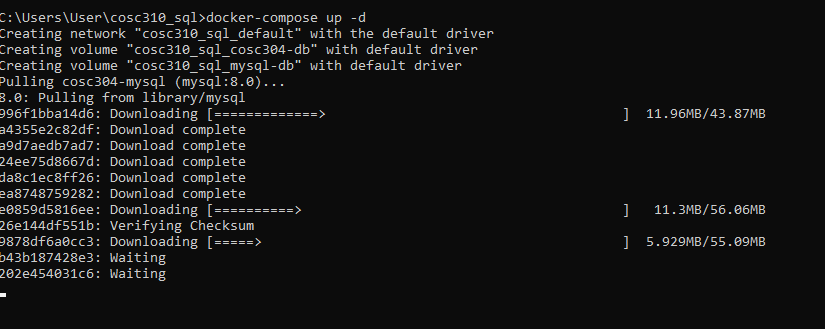
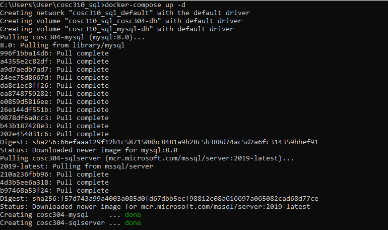
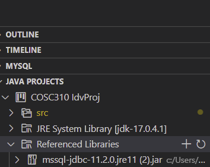

# Running and Compiling

To find the software setup instructions, please refer to [setup instructions](/setup)

The necessary files to create the container for the SQL server can be found on the GitHub page under the file ```cosc310_sql_setup```. 

To setup the Docker container, create a directory either through the command prompt or manually. This can be name anything but for simplicity and example, the file will be referred to as ```cosc310_sql```

Once the directory is created, copy all the contents of the ```cosc310_sql_setup``` into the directory

In a command shell, first change the directory to be the directory created. 
```
cd cosc310_sql 
```
Next, run the following command to extract all the files into the Docker container
```
docker-compose up -d
```
If everything has been extracted, Docker should look like so:





If everything is successful, MySQL should run on the port 3306. If a port conflict occurs, change th eport to 3307 in the docker-compose.yml file

Once Docker has been setup, clone the GitHub Repository and run “MainMenu.java” to get started. 

Inside VSCode, the MSSQL driver [mssl-jdbc-11.2.0.jre11.jar](/mssql-jdbc-11.2.0.jre11.jar) needs to be added to the Referenced Libraries in order to run the code properly. Once this is done, everything should run properly.



# Introduction
This is an inventory management system. It is designed to:
1. Monitor stock levels on various materials and products
2. Mark down positions of various materials and products within the storage facility
3. Collect data on stock level changes, supply times and defective batches of supply
4. Plan ahead for a schedule to order new batch of materials based on consumption and lead time
5. Cooperate with management personnel decisions to alter ordering strategy in response to external factors such as drop in supply cost or difficulty getting supplied in the foreseeable future
6. Alert the responsible individuals when stock levels are not expected to sustain normal operations of the company for an adjustable number of days ahead
# StockLevel
The Stock Level component of the system consists of 3 classes "mainStock", "ProductWriter", and "DataReader". The ProductWriter class contains all the methods and functions necessary to write new products in the inventory/stock, while the DataReader class contains all the methods that reads and returns the stock levels in the inventory. 

## MainMenu:

This class contains a main method that calls the method CreateAndShowGUI();. The CreateAndShowGUI() method is responsible for constructing the layout and components onto the window application pop-up. The class contains imports from java.awt and javax.swing, which is the API used to create the windowed GUI. The MainMenu class contains 4 buttons to let the user select a feature of the inventory system and direct them to the resepective classes. 

## mainStockGui:

This class contains the functions of the Stock Level Monitoring component, and is the main change to the system since the last iteration. The class has the same features as MainMenu does, except it contains extra buttons to allow the user to go back to MainMenu, or exit the program by calling System.exit(0); The “Add Product” button calls on the AddProduct class that is in charge of requesting product specific values from the user and interacting with JDBC to insert the product into the database. The “View Product” button calls the ViewProduct class which retrieves the requested product onto the GUI. The “Edit Product” button calls the EditProduct class which prompts the user to select what changes they would like made to a product. 

## ViewProduct:

The ViewProduct class behaves similarly to the previous two classes, utilizing AWT and Swings to include buttons and labels on the layout to provide users a better and smoother experience in viewing products. ViewProduct contains the method displayProducts() that calls the method from the DatabaseReaderJDBC class to display the products that are available onto a text area. The class also contains the method displayResults() which after the user selects a product to view, is called to call on the method viewProduct() from the DatabaseReaderJDBC class to display the product information that the user requested. 

## AddProduct: 

The AddProduct class is much like the other classes in terms of its layouts. However, it prompts the user to enter information about a new product that the user would like to add into the database such as product id, or product name, and then calls the addProduct() method from the DatabaseReaderJDBC class to implement these additions

## EditProduct:

Much like the AddProduct class, the EditProduct class prompts the user for information on specific changes that they want made onto a product on the database. This could be the product id, product label, etc. Once the program gets the necessary information from the user, the editProduct() method from the DatabaseReaderJDBC class is called onto and updates the changes in the database. 

## DatabaseReaderJDBC

This class serves as the bridge between the GUI and the database. Using the JDBC API, the class is able to include methods that execute SQL queries to reflect changes onto the database. The class contains the methods addProduct(), viewProduct(), editProduct(), and prodList() . The class contains the connection information to connect with the database and make the necessary SQL queries. It imports the java.sql library to use features like the DriverManager, connections, and PreparedStatements to name a few. 

The addProduct(String[] inputs) method takes in a String array from the AddProduct class, which contains the information like the product name, id, etc. for the method to add a new product in the database. The method uses an SQL INSERT statement inside a  PreparedStatement with 9 values that reflect the attributes of the product database (e.g. productId, productName, etc.). The PreparedStatement ensures that an SQL injection attack does not occur, and if one does, an error code is returned and the values are not inserted. 

The editProduct(String prod, String attr, String change) takes 3 Strings as parameters, prod being the product to be changed, attr being the attribute (e.g. productId, productName) that is going to be changed, and change is the new change that the user is requesting to change. These are then put into an SQL UPDATE statement inside a PreparedStatement to prevent SQL injection attacks, and the update is executed if it is valid. Otherwise an error code is returned and reflected on the GUI. 

The viewProduct(String prod) method takes a String as a parameter, which is the product that the user requests to view. This String is then placed inside a SELECT statement inside a PreparedStatement to return the product information, which is then stored in a return array for the GUI to represent visually. 

The prodList() method takes no parameters but returns a String array containing the list of products in the database which is retrieved using the SELECT statement, placing it inside a ResultSet, and iterating through each one of the columns to retrieve only the productNames.


# StorageMap
StorageMapComponent is a class containing 5 methods named processOperations(), list(), store(), find() and take(). 
processOperations() allows the user to select a function and calls in other appropriate methods accordingly. It also repeats when the function is done so the next function can be selected right after. 
- list() will list all entries from the storage sites database represented by text files office.txt and warehouse.txt by calling list() in Office class or Warehouse class. The user chooses the storage site via text input to the console. 
- store() lets the user add lines of information to the storage. It first asks for the barcode to be entered in order to search for potentially repetitive entries through the find() method in Office class and Warehouse class. If there is, it will prompt the user to decide whether it should continue the storing process. It will next ask for the user to decide the storage site and pass through the barcode as a string to the store() method in the class for the chosen storage site. 
- find() searches for a barcode entered by the user in all storage site databases by passing through the barcode as a string to both find() methods in Office class and Warehouse class which returns a boolean. If it is true, the barcode will be passed through to the locate() method in Office class and Warehouse class which will print the location of the stored item with matching barcode to the console. 
- take() deletes lines of information from the storage database. It starts by asking for the barcode and passing it to the find() method in Office class and Warehouse class . If entries with the matching barcode is found, it will pass through the barcode to take() method in Office class and Warehouse class to delete the line of information while also printing the storage sites and location within the site through the console.

Storage class is an interface for all classes in the locations package. It has 5 methods, list(), store(), find(), locate() and take(). It is only used to make sure classes in the locations package will implement all these methods in order to be compatible with the StorageMapComponent class.

Office class implements Storage class with the same 5 methods. 
- list() calls on the listInventory() method in FileReaderWriter class and passes through the “Office” string so it would read from office.txt. It is also responsible for catching exceptions from listInventory() and will print an error message in the console.
- store() formats the line of information to be stored into office.txt while confirming the action by printing a message in the console. It combines the barcode parameter taken from the caller method and location name entered by the user to form a new spot string. This spot string along with the “Office” string are passed over to the storeIntoInventory() method in FileReaderWriter class. It is also responsible for catching exceptions from storeIntoInventory() and will print an error message in the console.
- find() calls the findInInventory() method in FileReaderWriter class and passes through both storage and barcode parameters received from its caller method into findInInventory(). It also catches exceptions from findInInventory() and prints an error message in the console if triggered.
- locate() calls the locateInInventory() method in FileReaderWriter class and passes through both storage and barcode parameters received from its caller method into locateInInventory(). It also catches exceptions from locateInInventory() and prints an error message in the console if triggered.
- take() calls the takeFromInventory() method in FileReaderWriter class and passes through both storage and barcode parameters received from its caller method into takeFromInventory(). It also catches exceptions from takeFromInventory() and prints an error message in the console if triggered.

Warehouse class implements Storage class with the same 5 methods.
- list() calls on the listInventory() method in FileReaderWriter class and passes through the “Warehouse” string so it would read from warehouse.txt. It is also responsible for catching exceptions from - listInventory() and will print an error message in the console.
- store() formats the line of information to be stored into warehouse.txt while confirming the action by printing a message in the console. It combines the barcode parameter taken from the caller method and location in the form of 3 integers corresponding to a 3D coordinate system used by the storage site which is entered by the user to form a new spot string. This spot string along with the “Warehouse” string are passed over to the storeIntoInventory() method in FileReaderWriter class. It is also responsible for catching exceptions from storeIntoInventory() and will print an error message in the console.
- find() calls the findInInventory() method in FileReaderWriter class and passes through both storage and barcode parameters received from its caller method into findInInventory(). It also catches exceptions from findInInventory() and prints an error message in the console if triggered.
- locate() calls the locateInInventory() method in FileReaderWriter class and passes through both storage and barcode parameters received from its caller method into locateInInventory(). It also catches exceptions from locateInInventory() and prints an error message in the console if triggered.
- take() calls the takeFromInventory() method in FileReaderWriter class and passes through both storage and barcode parameters received from its caller method into takeFromInventory(). It also catches exceptions from takeFromInventory() and prints an error message in the console if triggered.

FileReaderWriter class is a class containing 6 methods, listInventory(), storeIntoInventory(), findInInventory(), locateInInventory(), takeFromInventory() and splitOnSpace().
listInventory() takes in the storage parameter to decide whether it would work on office.txt or warehouse.txt. Then it would take the first line in the selected text file, separate it into multiple parts with the help of the splitOnSpace() method and format the information into a whole line that is printed by the console for the user to read. This process is repeated with a for loop until all lines in the text file have been processed.
- storeIntoInventory() takes in storage and spot string parameters from its caller method. Storage parameter is used to decide whether office.txt or warehouse.txt will be processed while spot parameter is the line of information that is added into the text file. Due to the way Java’s PrintWriter class works, existing information will have to be copied to memory space, information from the spot parameter is added to it and finally all information will replace everything within the text file.
- findInInventory() takes in two parameters, storage and barcode from its caller method. Storage parameter is used to decide whether office.txt or warehouse.txt will be processed. The splitOnSpace() method is used to separate each line into parts and the first part will be tested on whether it’s the same as the barcode parameter. If it finds at least 1 match in the whole text file, it will return true to the caller method and false otherwise. 
- locateInInventory() takes in two parameters, storage and barcode from its caller method. Storage parameter is used to decide whether office.txt or warehouse.txt will be processed. The splitOnSpace() method is used to separate each line into parts and the first part will be tested on whether it’s the same as the barcode parameter. When it finds a match, it will format the whole line of data and print in the console to show to the user. This is repeated until the whole text file has been processed.
- takeFromInventory() takes in two parameters, storage and barcode from its caller method. Storage parameter is used to decide whether office.txt or warehouse.txt will be processed. The splitOnSpace() method is used to separate each line into parts and the first part will be tested on whether it’s the same as the barcode parameter. When it finds a match, it will format the whole line of data, print in the console and delete the line from the text file. Due to the way Java’s PrintWriter class works, it has to copy all existing information to memory space, remove the line we found a match on and finally all information will replace everything within the text file.
- splitOnSpace() splits the line passed into it into multiple parts based on space in each line.

StorageMapTester class is a tester class which tests methods within Office, Warehouse and FileReaderWriter classes. 


# Stopper (Alert System)
The stopper or the alert system used in the inventory consists of three clases which are "Application", "Material", and "MaterialList".

Application class is the class that has all the alert system functions are combined to be executed when the feature is run by the user. Inside of the class, there are three functions. The first, the crucial one for the execution of the feature, is called "runAPP". It has all the functions written in other classes to run the alert system properly. The second function inside the Application class is called as "materialAdd". As it can be guessed from its name, it does add the names, amounts, maximum and minimum values of each material stored in the inventory. The third, and the final function inside this class, is named as "importExport". In this function, it performs either import or export process depending on the user's answers to the questions on the console. Questions helps to decide which material and amount to be imported or exported. The code functions with switch case. 


Material class is where the material is added. In other words, its constructor method is used as a materials data input panel. Due to this reason, it also consists of getters and setters. In addition, this is where the limits are chceked by the user's imputs to the console with "importAmount" and "exportAmount" functions. If the limits are exceeded, it executes execptions to show that limits are passed. One feature of the "exportAmount" function is that it bumps up a warning message if the amount of a material drops below the mimimum limit.  

As for the final class of the stopper feature, MaterialList class, it stores the materials as an arraylist made inside this class. With this informtaion, it has functions related to arraylist like: adding material, getting material list to see which elements are stored inside, or a different way to print the elements inside the arraylist using "toString" function.

# Stopper Functions

public String toString():it returns the elements to the console in a different format.
  
public void checkMinAmount(): checks if the amount left is below minStock.
  
public void giveWarning(): It gives the warning the user if the stock is below minStock.
  
public void runApp() throws LimitExceededException: it is the main function of the alert.
    
private void importExport(String appType, int materialIndex, int amount) throws LimitExceededException: it does the export and import applications based on the users choices.

These functions were implemented to improve the quality of the user interface. In other words, to increase the usability of the software. If these features were not implemented, it would be a lot harder fot the user to understand and to use the program.

# Base Plan

The basic plan and layout of the whole system. It shows how the system run.

public void take(): This function is used to take items from the warehouse.

public void returned(): This function is used to restock items.

public int getPrice(): This return the price of an item.

void checkOut(String iname): Check the name of the input item name and match with the corresponding function.

public void receivePrice(): Used to enter the price of an item.

public void listInventory(): Used to show the list of the inventory.

